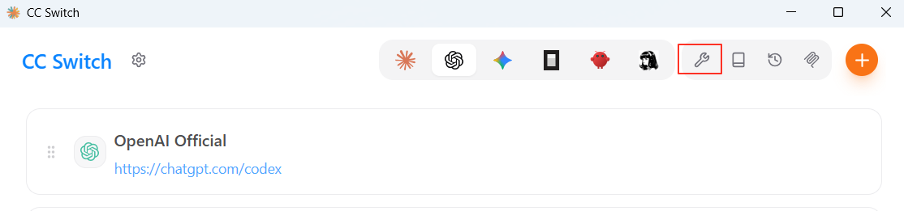
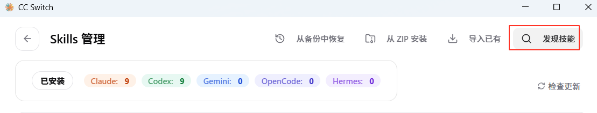
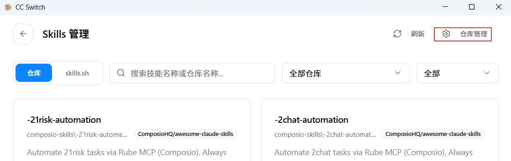
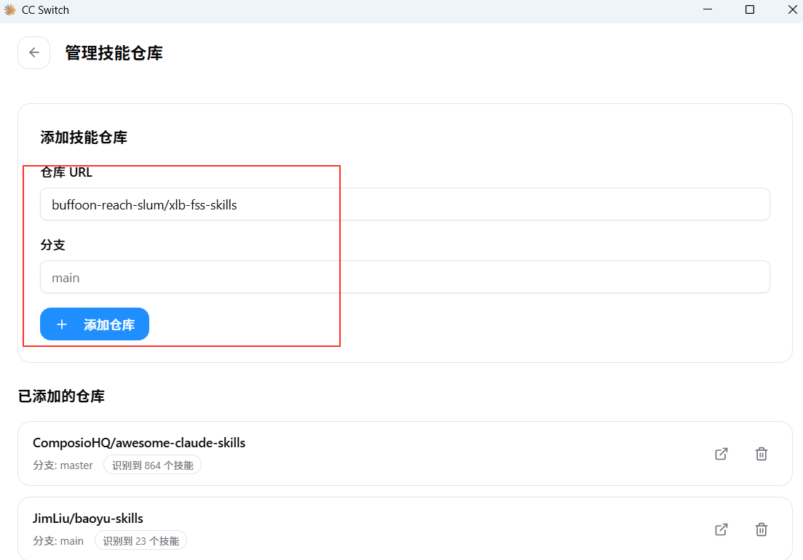
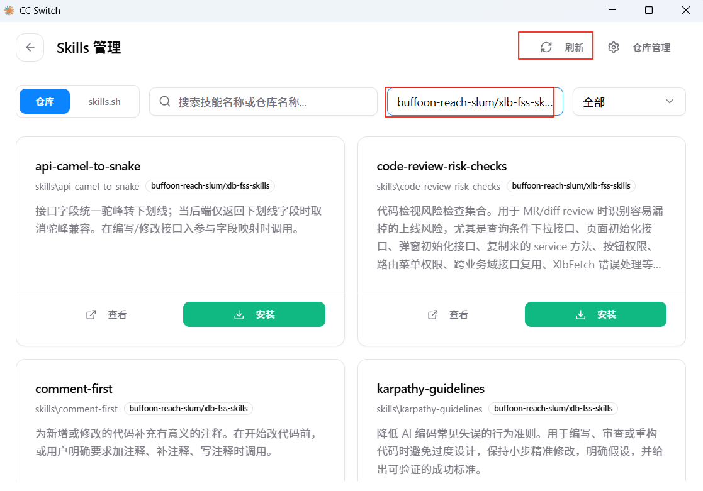
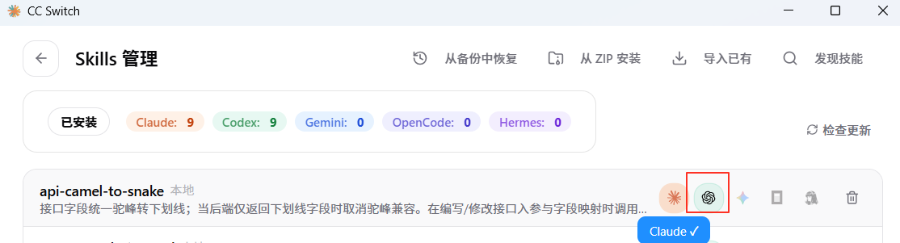

# xlb-fss-skills

FSS/XLB 团队 Codex skills 集合，用于沉淀接口字段、XlbFetch、列表页、弹窗和代码 review 等项目规范。

## 使用说明（重点：CC Switch 导入）

### 1. 准备仓库信息

在 GitHub 先确认以下参数：

- Owner：仓库所属的 GitHub 用户名或组织名（例如 `buffoon-reach-slum`）
- Name：`xlb-fss-skills`
- Branch：`main`
- Subdirectory：`skills`

### 2. 在 CC Switch 中添加仓库

按以下步骤操作：

1. 打开 `Skills`
   
   

2. 进入 `Repository Management`
   
   

3. 点击 `Add Repository`
   
   

4. 填写仓库参数：
   - 仓库 URL：`buffoon-reach-slum/xlb-fss-skills`
   - 分支：`main`
   
   

5. 点击保存并同步（`Save` / `Sync`）
   
   

6. 点亮对应的应用开关如codex，点亮后codex或者claude即可应用
   
   

### 3. 常见问题

- 看不到 skill：检查 `Subdirectory` 是否为 `skills`，分支是否为 `main`，目录下是否存在 `SKILL.md`
- 没有 push 权限：不影响导入使用；提交修改请走 `Fork + PR`，或联系管理员添加 `Write` 权限
